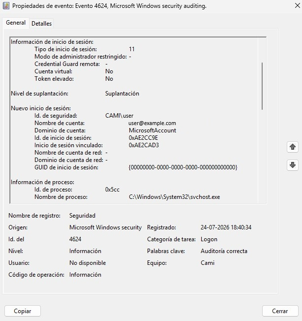
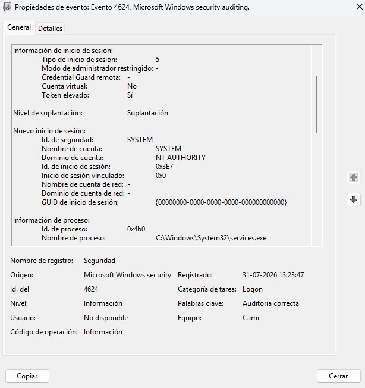

# windows-event-log-analysis
Análisis del registro de eventos de seguridad de Windows desde la perspectiva de un SOC de nivel 1.

# Windows Event ID 4624 Authentication Investigation

## Overview

This project documents a basic Windows authentication investigation performed from a Blue Team / SOC Tier 1 perspective.

The goal was to analyze Windows Security Event Logs, identify successful authentication events, understand different logon types, and determine whether the activity represented normal or suspicious behavior.

---

## Objectives

- Understand Windows Security Event ID 4624 (Successful Logon).
- Analyze authentication details from Windows Event Viewer.
- Identify different Windows Logon Types.
- Determine whether authentication activity is expected or suspicious.
- Document findings using a SOC-style investigation report.

---

## Environment

- Operating System: Windows
- Log Source: Windows Event Viewer
- Log: Security
- Event ID: 4624 - Successful Logon

---

## Investigation Summary

Two authentication events were analyzed:

### Event 1 - Cached Interactive Logon

**Logon Type:** 11

**Account:** CAMI\user

**Analysis:**

The event represents a cached interactive authentication performed by a user account.

The associated process was:
----------------------------------------------------------------------------------------------------------

C:\Windows\System32\svchost.exe

The activity was considered normal because the process belongs to the Windows operating system and no suspicious indicators were identified.

---

### Event 2 - Service Logon

**Logon Type:** 5

**Account:** NT AUTHORITY\SYSTEM

**Analysis:**

The event represents a service authentication performed by the Windows SYSTEM account.

The associated process was:
----------------------------------------------------------------------------------------------------------

C:\Windows\System32\services.exe

This behavior is expected because services.exe manages Windows services.

---

## Findings

The investigation identified:

- User authentication through Cached Interactive Logon.
- System authentication through Service Logon.
- Legitimate Windows processes involved in both events.

No indicators of compromise were identified.

---

## Tools Used

- Windows Event Viewer
- Windows Security Logs
- Markdown documentation

---

## Skills Demonstrated

- Windows Event Log Analysis
- Authentication Event Investigation
- Logon Type Identification
- Basic SOC Alert Triage
- Security Documentation

---

## Report

Detailed investigation:

[Windows Authentication Analysis Report](reports/windows-authentication-analysis.md)

---

## Evidence

### Event ID 4624 - Cached Interactive Logon (Logon Type 11)

### Event ID 4624 - Service Logon (Logon Type 5)

